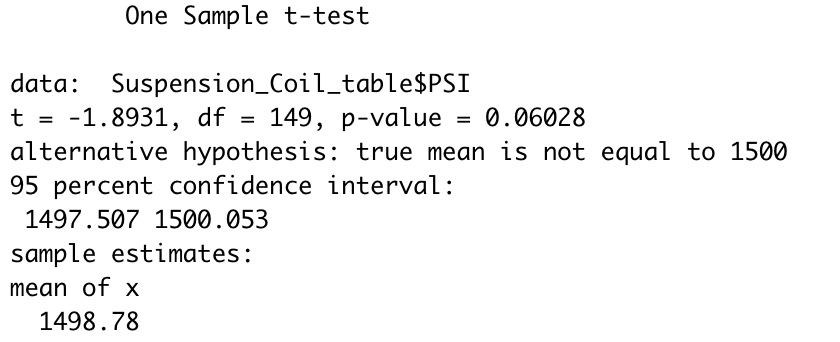

# MechaCar_Statistical_Analysis

## Linear Regression to Predict MPG

As we can see in the picture above, in the summary output, each Pr(>|t|) value represents the probability that each coefficient contributes a random amount of variance to our liner model. As per our results, vehicle length, ground_clearance, vehicle, as well as intercept are statistically unlikely to provide random amounts of variance. Alternatively stated, these coefficients previously mentioned have a significant impact on mpg. 

The slope of the linear model is not considered to be zero because the p-value from our hypothesis test "p-value = 5.35e-11" is much smaller than our assumed significance level of 0.05%. Therefore, we can state that there is sufficient evidence to reject our null hypothesis "H0: The slope of the linear model is zero, or m = 0". 

From our linear regression model, we have obtained an r-squared value of 0.71, which means that roughly 71% of all mpg of MechaCar predictions will be correct. 

## Summary Statistics on Suspension Coils

The table below contains the summary of the design specification for all manufacturing lots. The total variance of the suspension coils is 62.29, which is below the 100 pounds per square inch limit. 

On the other hand, when we look at the summary table for each lot individually, we can observe that Lot1 and Lot2 have variances of 0.98 and 7.47, respectively, which is below the 100 pounds per square inch threshold. However, Lot3 far exceeds the threshold with a variance of 170.29 PSI.

## T-Tests on Suspension Coils

After performing the one-tailed t-test to determine if the PSI across all manufacturing lots is statistically different from the population mean of 1,500. We have obtained a p-value= 0.06. With a significance level of 0.05 percent, the p-value is above our significance level by 0.01. Therefore, we do not have sufficient evidence to reject the null hypothesis, and we would state that the two means are statistically similar. 

We have performed the t-test to determine if the PSI for each manufacturing lot is statistically different from the population mean (see image below).

The obtained p-values for lot1 and lot2 are p=1 and p=0.61, respectively. Assuming a significance level of 0.05%, we do not have sufficient evidence to reject the null hypothesis, therefore, there is no statistical difference between the means. 

Conversely, the obtained p-value= 0.04 for lot3 is below the significance level of 0.05%. We can reject the null hypothesis, which means that the PSI for this manufacturing lot is statistically different from the population mean of 1,500 pounds per square inch.

## Study Design: MechaCar vs Competition

We want to perform a statistical study to quantify how the MechaCar performs against the competition. A few of the most important metrics to consider that would of interest to customers are:

* Maintenance cost
* Safety rating
* City and highway fuel efficiency
  
The proposed hypotheses would be:

Ho = There is no statistical difference between the mean of each metric from MechaCar to be evaluated and that of the competitors.
Ha = There is a statistical difference between the mean of each metric from MechaCar to be evaluated and that of the competitors.

The test to be performed would be a two-sample-t-test because we are testing if the means are equal or not. 

To run this test, we will need:
* Input data that is numerical and continuous and normally distributed. 
* Sample data that was selected randomly from its population data.
* A sample size reasonably large.

